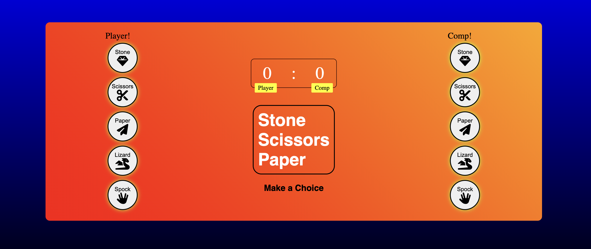
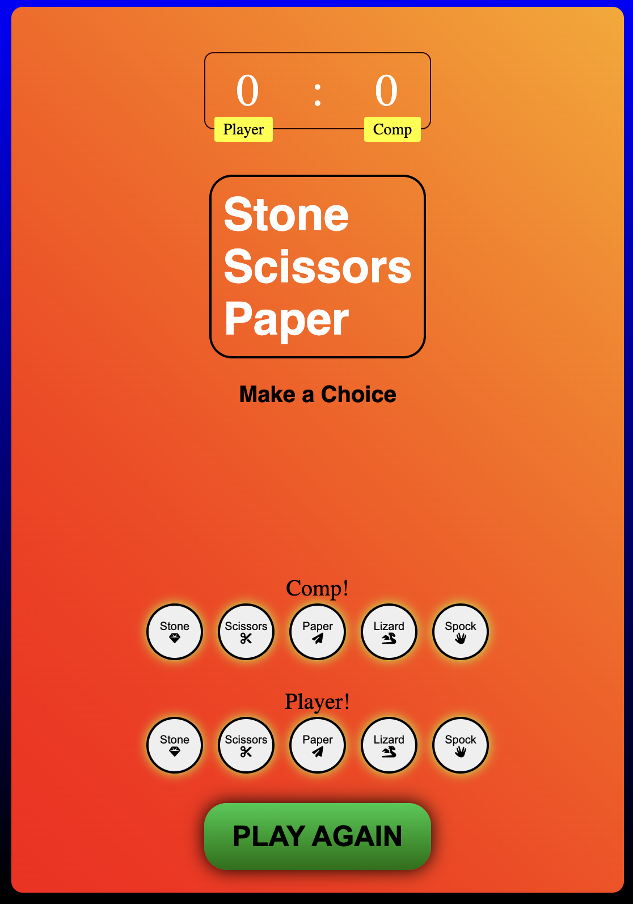

# Rock Paper Scissors Lizard Spock 🎮

A classic game expanded with the "Lizard Spock" rules, famous from *The Big Bang Theory*. This project demonstrates basic DOM manipulation, event handling, and clean code principles.

## 🌟 Features
- **Dynamic Gameplay:** Interactive UI with animations and sound effects.
- **Responsive Design:** Optimized for both desktop and mobile devices.
- **Smart Logic:** Game rules are implemented using a data-driven approach (objects) instead of bulky conditional statements.

## 🛠 Tech Stack
- **HTML5 & CSS3:** Semantic markup and custom animations.
- **JavaScript (ES6+):** Async logic, DOM manipulation, and dry-coded game rules.
- **FontAwesome:** For clear and modern icons.

## 🔄 Self-Review & Refactoring (Recent Updates)
This project was recently refactored to showcase my growth as a developer:
- **From Switch to Object Mapping:** Replaced a 25+ line `switch-case` block with a concise `GAME_RULES` object. This improved maintainability and scalability.
- **Clean Code Principles:** Implemented `const/let` properly, used template literals, and extracted reusable UI logic into a separate `updateUI` function (DRY principle).
- **Architecture:** Decoupled game logic from DOM updates for better readability.

## 📸 Preview


*Desktop and Mobile versions*

## 🚀 How to Run
1. Clone the repository:
   ```bash
   git clone [https://github.com/Mr-RomanS/Lizard_Spock.git](https://github.com/Mr-RomanS/Lizard_Spock.git)